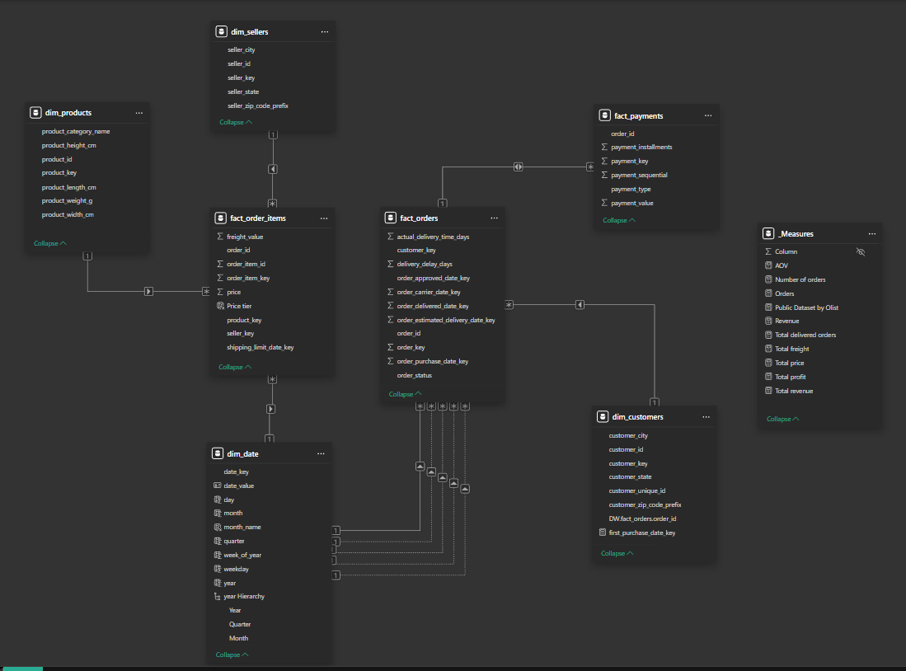

# E-commerce analytics pipeline using Olist Dataset

## Project overview

This project implements an end-to-end data analytics pipeline for the **Olist Brazilian E-commerce Public Dataset**, a real-world dataset containing over 100,000 records of e-commerce transactions from Brazil.
### Objectives
- Ingest and process raw CSV data into a structured data warehouse.
- Perform data cleaning, transformation, and modeling to enable scalable analytics.
- Build interactive visualizations to analyze revenue, customer behavior, product performance, and operational efficiency.
- Demonstrate a full ETL (Extract, Transform, Load) workflow using SQL and BI tools.

### Dataset
- **Source**: [Olist Brazilian E-commerce Public Dataset](https://www.kaggle.com/datasets/olistbr/brazilian-ecommerce) (publicly available on Kaggle).
- **Scope**: Covers 100k+ orders from 2016–2018, including customers, products, sellers, payments, reviews, and geolocation data.
- **Key themes**: E-commerce metrics like revenue trends, payment methods, delivery performance, and product category analysis.

### Tools & technologies
- **Database**: SQL Server (for RAW, STG, and DW layers).
- **ETL/IDE**: DBeaver (for data import, querying, and transformation).
- **Visualization**: Power BI (for dashboards and interactive reports).
- **Schema Design**: Star schema (dimensions and facts) for efficient querying.

### Project structure
```
Olist_Ecommerce_Dashboard/
├── 1. data/                                # original data
│   ├── olist_customers_dataset.csv
│   ├── olist_geolocation_dataset.csv
│   ├── olist_order_items_dataset.csv
│   ├── olist_order_payments_dataset.csv
│   ├── olist_order_reviews_dataset.csv
│   ├── olist_orders_dataset.csv
│   ├── olist_products_dataset.csv
│   ├── olist_products_dataset_og.csv
│   └── product_category_name_translation.csv
├── 2. stg (silver)/                        # (Silver Layer)
│   └── Stg_layer.sql                       # Script ETL from RAW -> STG
├── 3. dw (gold)/                           # (Gold Layer)
│   └── Dw_layer.sql                        # Script DDL/ETL from STG -> DW (DIM/FACT)
├── 4. dashboard/                           # Contains Power BI file
│   └── Olist_dashboard.pbix
├── images/                                 # assets
│   ├── overview.png
│   ├── products.png
│   └── schema.png
└── README.md                               # Description file
```
## System architecture

The pipeline follows:

```
CSV Files → RAW Schema → STG Schema → Data Warehouse (DIM/FACT) → Power BI Dashboards
```

- **RAW layer**: Direct ingestion of source CSVs (unmodified).
- **STG layer**: Data cleaning and standardization.
- **DW layer**: Star schema with dimensions (DIM) and facts (FACT) for analytics.
- **Consumption Layer**: Power BI for visualization and self-service BI.

## Database design

### 3.1 RAW layer
Stores original CSV data without modifications to preserve 100% fidelity. No primary keys (PK), foreign keys (FK), or indexes.

| Table Name      | Rows × Columns | Description |
|-----------------|----------------|-------------|
| `raw.orders`   | 99,441 × 8    | Order details (e.g., status, dates). |
| `raw.order_items` | 112,650 × 7 | Order line items (e.g., product, price). |
| `raw.customers` | 99,441 × 5   | Customer info (e.g., ID, location). |
| `raw.products` | 32,951 × 9   | Product catalog (e.g., dimensions, category). |
| `raw.sellers`  | 3,095 × 4    | Seller details (e.g., location). |
| `raw.reviews`  | 99,224 × 3   | Order reviews (e.g., scores). |
| `raw.payments` | 103,887 × 5  | Payment transactions (e.g., type, value). |
| `raw.geolocation` | 1,000,163 × 5 | Geographic coordinates by ZIP code. |

### 3.2 STAGING layer (STG)
Copied from RAW with cleaning:
- Standardize data types.
- Handle NULLs, trim strings, remove duplicates.
- Format datetimes.
- Specific cleanings:
  - `geolocation`: Normalize city names (e.g., "São Paulo" → "Sao Paulo" via regex and accent removal; reduced from 8,010 to 5,931 distinct values).
  - `orders`: Flag invalid dates (e.g., 23 cases of received before delivered; 1,359 delivered before approved).
  - `products`: Fill missing `product_category_name` with 'others' (623 records).
  - Other tables: Minimal issues (e.g., customers, payments, reviews are clean).

### 3.3 Data warehouse (DW) layer
**Star Schema** with 4 dimension tables (DIM) and 3 fact tables (FACT) for OLAP-style analysis.

#### Dimension tables (DIM)
| Table          | Business Key | Surrogate Key | Grain                  | Key Attributes |
|----------------|--------------|---------------|------------------------|----------------|
| `dim_customers` | `customer_id` | `customer_key` | 1 row = 1 customer   | City, ZIP code, state, unique ID prefix. |
| `dim_products` | `product_id` | `product_key` | 1 row = 1 product    | Dimensions (height/width/length/weight), category name. |
| `dim_sellers`  | `seller_id`  | `seller_key`  | 1 row = 1 seller     | City, ZIP code prefix, state. |
| `dim_date`     | `date_value` | `date_key` (YYYYMMDD) | 1 row = 1 date | Day, month, quarter, year, weekday, week-of-year, fiscal hierarchy. |

#### Fact tables (FACT)
| Table               | PK            | Grain                          | Foreign Keys | Measures |
|---------------------|---------------|--------------------------------|--------------|----------|
| `fact_orders`      | `order_key`  | 1 row = 1 order               | Customer, multiple date keys (purchase, approved, delivered, etc.) | Delivery days, order status flags. |
| `fact_order_items` | `order_item_key` | 1 row = 1 item in 1 order | Order, product, seller, shipping limit date | Price, freight value, quantity. |
| `fact_payments`    | `payment_key`| 1 row = 1 payment transaction | Order       | Payment type, sequential, value. |

## ETL pipeline

### 4.1 CSV Import to RAW
- Use DBeaver to connect to SQL Server.
- Import CSVs with column mapping to match headers.
- Preserve original data types; no cleaning at this stage.

### 4.2 RAW to STG (Data cleaning using SQL)
- SQL scripts for transformation (e.g., `INSERT INTO stg_table SELECT ... FROM raw_table` with CASE/WHEN for cleaning).
- Output: Cleaned tables ready for DW population.

### 4.3 STG to DW (Building DIM/FACT tables)
- Generate surrogate keys (e.g., IDENTITY or ROW_NUMBER).
- Created 4 dim tables with 3 fact tables
- Populate DIMs first (unique rows via DISTINCT).
- Join STG tables to FACTs using business keys.
- Example: `fact_order_items` joins `stg_order_items` with DIM lookups for product/seller keys.
- Data modeling using STAR schema

## Power BI Dashboards

The pipeline feeds into **2 interactive dashboards** in Power BI, focusing on e-commerce visualization. Slicers include Year, Product Category, State, and Order Status. Hover for details; click Y-axis for filtering.

### 6.1 Overview dashboard

- **KPIs**: Total Revenue ($16.01M), Total Profit ($2.42M), Customers (96.1K), Orders (99.44K), AOV ($160.99).
- **Visuals**:
  - Orders & Revenue by Quarter (bar/line chart).
  - Payment Type Distribution (pie: Credit Card 75.2%, Boleto 28.4%, etc.).
  - Top 5 Cities by Revenue (e.g., Sao Paulo: $2.3M).
  - Total Price & Freight by Quarter (stacked area).

### 6.2 Products dashboard

- **KPIs**: Products Sold (112.65K), Total Price ($13.59M), Categories (32.95K), Sellers (3.1K).
- **Visuals**:
  - Revenue by Product Category (bar: Health & Beauty leads).
  - Revenue by Price Tier (pie: Mid $4.74M / 48.8%).
  - Top/Bottom 10 Orders per Category (heatmaps: e.g., Bed Bath Table 11K orders; Security 2 orders).

**Notes**:
- Drill-through enabled for quarters/months.
- Y-axis clickable for dynamic filtering.
- Data refreshes via SQL queries to DW.

## Key insights
- **Revenue Trends**: Q2 shows peak orders/revenue; freight costs rise in Q4.
- **Product Performance**: Health & Beauty dominates (top category); low-price tiers drive volume but lower margins.
- **Geographic Hotspots**: Sao Paulo and Rio de Janeiro account for ~40% of revenue.
- **Payment Preferences**: Credit cards are dominant (75%), indicating financing trends in Brazil.

## How to use
1. **Setup database**: Install SQL Server; create schemas (RAW, STG, DW).
2. **Import data**: Download Olist CSVs; use DBeaver to load into RAW.
3. **Run ETL**: Execute provided SQL scripts (RAW → STG → DW).
4. **Build dashboards**: Connect Power BI to DW; import visuals from .pbix files.
5. **Explore**: Use slicers to filter by time, location, or category.

## Future enhancements
- Add ML models for demand forecasting.
- Expand to include review sentiment analysis.

---
